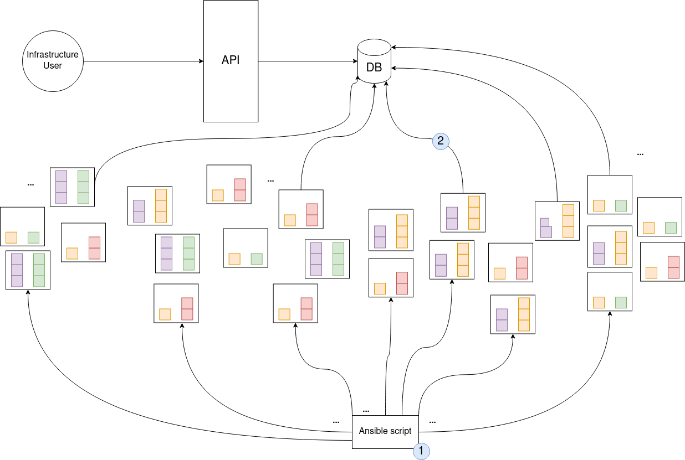

# Cluster Profiler Tool

This small tool consists of two applictions. The cluster-classifier-client analyses the nodes inside a heterogeneous cluster. We provide the following information:

* CPU, RAM, IO hardware specifications
* CPU single-thread and multi-thread performance benchmark
* RAM  benchmark
* IO sequential and random read-write benchmark

The cluster-classifier-api provides the gathered information as a REST API for usage:

* Information about a single node in the cluster
* Clusters inside the computing cluster, consisting of similar nodes
* Labelling the nodes inside a cluster based on the cluster centroids
* Labels the nodes controlled by Kubernetes to enable fine-granular mapping of computing resources

## BibTeX
```bibtex
@INPROCEEDINGS{bader2021tarema,
  author={Bader, Jonathan and Thamsen, Lauritz and Kulagina, Svetlana and Will, Jonathan and Meyerhenke, Henning and Kao, Odej},
  booktitle={2021 IEEE International Conference on Big Data (Big Data)}, 
  title={Tarema: Adaptive Resource Allocation for Scalable Scientific Workflows in Heterogeneous Clusters}, 
  year={2021},
  publisher={IEEE},
  pages={65-75},
  doi={10.1109/BigData52589.2021.9671519}}
```


## Prerequisites

<ol>
<li> Install ansible on your host-machine </li>
<li> Add all target servers to the ansible inventory under /etc/ansible/hosts </li>
<li> Please substitute the values from cluster-classifier-client/src/resources/application.properties with the values of your database

    spring.datasource.url=jdbc:mysql://${MYSQL_HOST:remotehost}:3306/db_example
    spring.datasource.username=yourDBusername
    spring.datasource.password=yourDBpassword
    
   You may also change the database by removing the MySQL driver from the pom.xml and add a new one (i.e PostgreSQL, MariaDB).
</li>
<li> run the following command in the cluster-classifier-client folder to build the executable jar:

    ./mvn clean package

</ol>

## Deploy cluster-classifier-client

<li> Execute the the ansible-playbook:

    ansible-playbook ./absible/run_cc.yml
</li>

## Check results with the API

<ol>
<li> run the following command in the cluster-classifier-api folder to build the executable jar:

    ./mvn clean package 
    
</li>

<li> run 
    
    java -jar cluster-classifier-api*.jar 
    
</li>
<li> You can see a list of available REST endpoints under 
    
    URL:PORT/swagger-ui/index.html
    
</li>
</ol>

## Clustering the nodes

For clustering the nodes we are using the KMeansPlusPlusClusterer (org.apache.commons.math3.ml.clustering) and implemented a Silhouette score to evaluate the number of clusters. The org.apache.commons.math3.ml.clustering offer multiple clustering methods. Moreover, one can extend The Clusterer to implement a custom clustering approach. If you want to implement an evaluation metric different from the Silhouette score, you can easily exchange our SilhouetteScore with another custom ClusterEvaluator.

## Labelling Kubernetes nodes

**To disable labelling for Kubernetes go to the application.properties file under cluster-classifier-api and set kube.enable to false. Switch to true to enable Kubernetes labelling.**

After clustering the nodes, our system starts labelling the nodes.  
In the first step, we compare the centroids, by defining the quartiles depending on the number of node groups. 

These labels are then stored in the database.

The class KubernetesNodeLabeller handels the labelling of the Kubernetes nodes. We are using a DefaultKubernetesClient. This means the we use the kube config file (~./kube(config) to create the connection. For a more advanced configuration you might want to use the DefaultKubernetesClient constructor, which uses a costum configuration.
The KubernetesNodeLabeller uses the Kubernetes API to set the labels from the NodeRepresentations to the Kubernetes nodes.


## How it works




## Usage without own cluster setup

If you do not have an own compute cluster but want to test the capabilities of our tool, you can use our predefined terraform setup. By executing terraform, you will set up Google Compute Engines with various hardware specifications.

**The current specification runs with GCP. However AWS or other cloud providers are possbible to use as well. Please refer to the official terraform documentation. Moreover, depending on the configuration cost might occur.**

<ul>
<li>Install Terraform on your local host machine</li> 
<li>Edit the ./terraform/main.tf file</li>
<li>Feel free to remove/add/change instances to from ./terraform/compute-engines.tf file</li>
    <li>Run <em>terraform init</em></li>
    <li>Run <em>terraform apply</em></li>
    <li>To destroy the setup run <em>terraform destroy</em> </li>
</ul>
